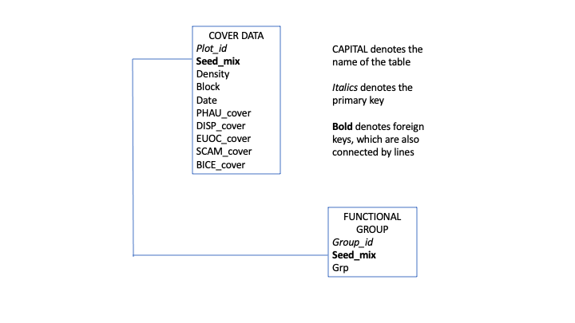

--- 
title: "A Minimal Book Example"
author: "John Doe"
date: "`r Sys.Date()`"
site: bookdown::bookdown_site
documentclass: book
bibliography: [book.bib, packages.bib]
# url: your book url like https://bookdown.org/yihui/bookdown
# cover-image: path to the social sharing image like images/cover.jpg
description: |
  This is a minimal example of using the bookdown package to write a book.
  The HTML output format for this example is bookdown::gitbook,
  set in the _output.yml file.
link-citations: yes
github-repo: rstudio/bookdown-demo
---

# About

This is the final project for Reproducible Data Science 2023. 

```{r, eval=FALSE}
bookdown::render_book()
```


```{r eval=FALSE}
bookdown::serve_book()
```


```{r include=FALSE}
# automatically create a bib database for R packages
knitr::write_bib(c(
  .packages(), 'bookdown', 'knitr', 'rmarkdown'
), 'packages.bib')
```

<!--chapter:end:index.Rmd-->

# My database structure

## Overview
The first step in preparing my data to be used as the final project of Reproducible Data Science 2023 was to create a database in R using RSQLite. The following code is an edited version of the code I used in Assignment 4.

## Introduction to my data
### My thesis
All the data used in this project comes from my 2022 field experiment, conducted at both Utah Lake and the Great Salt Lake. For my thesis, I am studying whether changes in the seeding density or functional diversity of my native seed mixes alter their biotic resistance (their ability to prevent invasive plants from entering the study area).

There are two leading theories about biotic resistance. Some ecologists believe that native plants that are most similar to the invasive plants of interest (in my case, *Phragmites australis*) will do the best at resisting the invader due to limiting similarity. In my case, this would mean that grasses do the best at resisting *Phragmites* growth. Other scientists believe that native plants that use the most resources and fill the most niche space will do the best at resisting invasives due to niche complementarity. In my case, this would be annual forbs because they grow the fastest and pre-empt the most light due to their large leaves. 

### My treatments
I conducted a full factorial experiment examining two levels of density (high and low) and five functional groups (grasses, bulrushes, rushes, annual forbs, and perennial forbs). On a bi-weekly basis, I collected canopy cover data within each plot to determine whether any of my treatments were particularly successful to preventing *Phragmites* and other invasives from entering. 

### My tables 
For this project, I will be using two tables. Although I had three tables in my Assignment 4, I will not be incorporating any biomass data into my analyses. 

My first table is called "cover". This table includes all the canopy cover estimates from my bi-weekly surveys.

The second table is called "functional group". This data keeps track of which functional groups are represented by each of my 10 seed mixes.

```{r image, fig.cap= "Database structure diagram", fig.align='center', out.width='100%'}

```

## Creating the database
### Getting started
The first step in creating a database is to install and load the `DBI` package. 

```{r package, eval=FALSE} 
library(DBI)
```

Now we are ready to create the database and link it to SQL. 

```{r database, eval=FALSE}
field_db <- dbConnect(RSQLite::SQLite(),
                      "field.db")
```

### Cover
Now we can make the "cover" table. As stated above, this table has all the data related to my canopy cover surveys.

The first step is to create the table. We will add the data to the table later. The columns in this table will include plot_id (an individual identifier of each plot made up of 1-3 characters), seed_mix (a tag to reference the seed mix used in the plot), density (either high 'H' or low 'L'), block (a number 1-6, referring to the replicate number), date, and the cover estimate of several species. Plot_id is the primary key. 

For this chapter, solely for the purpose of saving time and space, I will only be showing columns for 5 species of interest. When analyzing and visualizing my data, I will include the full list of species observed in my plots. 

Below is the RSQLite code to create the "cover" table. 

```{r cover-table, eval=FALSE}
#create all tables and enforce relationships
dbExecute(field_db, "CREATE TABLE cover (
          plot_id varchar(3) NOT NULL,
          seed_mix varchar(2) NOT NULL,
          density char(1) NOT NULL,
          block char(1) NOT NULL,
          date text,
          PHAU_cover varchar(2),
          DISP_cover varchar(2),
          EUOC_cover varchar(2),
          SCAM_cover varchar(2),
          BICE_cover varchar(2),
          PRIMARY KEY (plot_id)
          );")
```

### Functional groups

Now, we can make the "functional group" table. This table relates the functional groups of interest in my research to each of the 10 seed mixes used in my experiment. 

This table includes a group id (an individual marker for each functional group in the table), seed mix (referring to the seed mix I planted in my research), and the group (the functional group related to the seed mix). The group id is the primary key for this table. The seed mix is a foreign key that references the column "seed_mix" in the cover table. 

```{r group-table, eval = FALSE}
dbExecute(field_db, "CREATE TABLE functional_group (
          group_id char(1) NOT NULL,
          seed_mix varchar(2) NOT NULL,
          grp varchar(20),
          PRIMARY KEY (group_id)
          FOREIGN KEY (seed_mix) REFERENCES cover(seed_mix)
          );")
```

## Import data

The next step is to input the data into the tables we just created. Let's start with the cover table. The first step is to import the csv of my data. 

```{r import, eval = FALSE}
cover <- read.csv("/Users/elanafeldman/Documents/USUClasses/Thesis_Code/Field22/fb_sql.csv")
```

The csv includes all the data I want in my table except for the individual plot_id. Let's make that now.

```{r id, eval = FALSE}
cover$plot_id <- 1:nrow(cover)
```

Next we can join this new column tos the csv data and change all the names of the columns so that they match the names of the columns in the SQL table.

```{r names, eval = FALSE}
cover <- cover[,c("plot_id", "Group", "Density", "Block", 
                  "Date", "PHAU", "DISP", "EUOC", "SCAM", "BICE")]
names(cover)[2:10] <- c("seed_mix", "density", "block", "date", 
                       "PHAU_cover", "DISP_cover", "EUOC_cover", 
                       "SCAM_cover", "BICE_cover")
```

Now we can put all the data into the table!

```{r write, eval = FALSE}

dbWriteTable(field_db, "cover", cover, append = TRUE)
```

Finally, we can check that it all worked by making a query.

```{r query, eval = FALSE}

dbGetQuery(field_db, "SELECT * FROM cover LIMIT 10;")
```

Now let's do it all again for the functional group table.

```{r fg, eval = FALSE}

functional_group <- read.csv("/Users/elanafeldman/Documents/USUClasses/Thesis_Code/Field22/functional_group.csv")

functional_group$group_id <- 1:nrow(functional_group)

functional_group <- functional_group[,c("group_id", "seed_mix", "grp")]

dbWriteTable(field_db, "functional_group", functional_group, append = TRUE)

dbGetQuery(field_db, "SELECT * FROM functional_group LIMIT 10;")
```

<!--chapter:end:01-Database.Rmd-->

# Cleaning my data

## Overview of the Chapter
The first step was to clean all my data. The values collected in this experiment were percent cover of each species present in my 1m plot. Although the data are technically in cover classes (<1, 1-10, 10-20, 20-30, 30-40, 40-50, 50-60, 60-70, 70-80, 80-90, >99), data were written down as a single number meant to represent the lower value of the cover class (<1, 10, 20, 30, 40, 50, 60, 70, 80, 90, >99). For my data analyses, I will use the mid-point of the cover classes (5, 15, 25, 35, 45, 55, 65, 75, 85, 95). I intend to use the beta distribution for my analyses, and therefore need to nudge my upper and lower bounds into values between 0 and 1 (<1 -> 0.005, >99 -> .999). 

## Importing the data
I have two different spreadsheets, each representing one of my field sites. Both will be cleaned in the same way, but first I need to import the data and load all my packages. 

```{r data}
#Load packages
library(tidyverse)
library(lubridate) #my version of tidyverse does not seem to include lubridate

#Import data
fb <- read.csv("../../Cleaned-Data/clean_fb.csv")
ul <- read.csv("../../Cleaned-Data/clean_ul.csv")

```

## Cleaning the data
To begin, I will start by working with `fb`, which is all my data from Farmington Bay. One of the columns in my table is Date, which is the date of sampling.

```{r class}

class(fb$Date)

```

R is reading my date column as a character string! I need to fix this using lubridate so that R understands that my dates are dates.

```{r date}

fb$Date <- lubridate::mdy(fb$Date)

class(fb$Date)
```

Now I can move on to fixing my column names. When I `glimpse` my column names, I can see that not all of them make sense.

```{r glimpse}

dplyr::glimpse(fb)

```
My first column name is coming up as Block...FB. This column name does not follow the conventions we learned in class and it too complicated to type. I will change it to simply say Block. I also need to change the column Unk_Rush to be called Unk_Bulrush

```{r block}

names(fb)[1] <- "Block"
names(fb)[25] <- "Unk_Bulrush"

```

The most difficult part of cleaning my data is making sure all the cover values have been entered properly. Let's start by looking at the values in a random column.

```{r test}

unique(fb$BOMA)

```
We have a couple of problems here. First of all, the values are all being read as characters instead of numbers. This is because of my values that reads "<1". My first step will be to replace this value with a trace value that can be used in statistical analyses (typically one half of the smallest recorded value). After replacing that value, I will be able to change all these values into numeric values so they are no longer characters. This will also help to change my "" values to NA values. Next, my larger values were entered into the spreadsheet as percentages (10 = 10%, 20 = 20%). To perform my statistical analyses, these will need to be changes into proportions (10 -> .1, 20 -> .2). Finally, I want all my values to be on the mid-point of their cover class, not the bottom. Therefore, everything needs to increase by 0.05 (.1 -> .15, .2 -> .25).

```{r mutate}

fb <- fb %>% 
  mutate(Total.Cover = case_when(
  Total.Cover == "<1" ~ 0.005, #change all the <1 to the trace value of 0.005
  Total.Cover == "1" ~ 0.05, #change the 1s to 0.05 (because too small to work below)
  #all other numbers can stay as they are but numeric
  #but add 5 so they are at the mid-point of the cover class
  #and then divide them by 100 so they are proportions
  TRUE ~ (as.numeric(Total.Cover) + 5)/100
))

```

Now I just need to repeat this for all the columns between Total.Cover and Tamarisk. I originally tried to do this through a loop so I wouldn't need to copy and paste for each column, but unfortunately I could not get the loop to run in time. That can be a future project for me!

```{r all}

fb <- fb %>% 
  mutate(PHAU = case_when(
          PHAU == "<1" ~ 0.005, 
          PHAU == "1" ~ 0.05, 
          TRUE ~ (as.numeric(PHAU) + 5)/100 ),
         Cheno = case_when(
          Cheno == "<1" ~ 0.005, 
          Cheno == "1" ~ 0.05, 
          TRUE ~ (as.numeric(Cheno) + 5)/100),
        Typha = case_when(
          Typha == "<1" ~ 0.005, 
          Typha == "1" ~ 0.05, 
          TRUE ~ (as.numeric(Typha) + 5)/100),
        BOMA = case_when(
          BOMA == "<1" ~ 0.005, 
          BOMA == "1" ~ 0.05, 
          TRUE ~ (as.numeric(BOMA) + 5)/100),
        DISP = case_when(
          DISP == "<1" ~ 0.005, 
          DISP == "1" ~ 0.05, 
          TRUE ~ (as.numeric(DISP) + 5)/100),
        EUMA = case_when(
          EUMA == "<1" ~ 0.005, 
          EUMA == "1" ~ 0.05, 
          TRUE ~ (as.numeric(EUMA) + 5)/100),
        SYCI = case_when(
          SYCI == "<1" ~ 0.005, 
          SYCI == "1" ~ 0.05, 
          TRUE ~ (as.numeric(SYCI) + 5)/100),
        LEFA = case_when(
          LEFA == "<1" ~ 0.005, 
          LEFA == "1" ~ 0.05, 
          TRUE ~ (as.numeric(LEFA) + 5)/100),
        SCAC = case_when(
          SCAC == "<1" ~ 0.005, 
          SCAC == "1" ~ 0.05, 
          TRUE ~ (as.numeric(SCAC) + 5)/100),
        BICE = case_when(
          BICE == "<1" ~ 0.005, 
          BICE == "1" ~ 0.05, 
          TRUE ~ (as.numeric(BICE) + 5)/100),
        BIFR = case_when(
          BIFR == "<1" ~ 0.005, 
          BIFR == "1" ~ 0.05, 
          TRUE ~ (as.numeric(BIFR) + 5)/100),
        EUOC = case_when(
          EUOC == "<1" ~ 0.005, 
          EUOC == "1" ~ 0.05, 
          TRUE ~ (as.numeric(EUOC) + 5)/100),
        MUAS = case_when(
          MUAS == "<1" ~ 0.005, 
          MUAS == "1" ~ 0.05, 
          TRUE ~ (as.numeric(MUAS) + 5)/100),
        SCAM = case_when(
          SCAM == "<1" ~ 0.005, 
          SCAM == "1" ~ 0.05, 
          TRUE ~ (as.numeric(SCAM) + 5)/100),
        RUMA = case_when(
          RUMA == "<1" ~ 0.005, 
          RUMA == "1" ~ 0.05, 
          TRUE ~ (as.numeric(RUMA) + 5)/100),
        RUST = case_when(
          RUST == "<1" ~ 0.005, 
          RUST == "1" ~ 0.05, 
          TRUE ~ (as.numeric(RUST) + 5)/100),
        Unk_Forb = case_when(
          Unk_Forb == "<1" ~ 0.005, 
          Unk_Forb == "1" ~ 0.05, 
          TRUE ~ (as.numeric(Unk_Forb) + 5)/100),
        Unk_Grass = case_when(
          Unk_Grass == "<1" ~ 0.005, 
          Unk_Grass == "1" ~ 0.05, 
          TRUE ~ (as.numeric(Unk_Grass) + 5)/100),
        Unk_Bulrush = case_when(
          Unk_Bulrush == "<1" ~ 0.005, 
          Unk_Bulrush == "1" ~ 0.05, 
          TRUE ~ (as.numeric(Unk_Bulrush) + 5)/100),
        SARU = case_when(
          SARU == "<1" ~ 0.005, 
          SARU == "1" ~ 0.05, 
          TRUE ~ (as.numeric(SARU) + 5)/100),
        Tamarisk = case_when(
          Tamarisk == "<1" ~ 0.005, 
          Tamarisk == "1" ~ 0.05, 
          TRUE ~ (as.numeric(Tamarisk) + 5)/100)
  )
```

Now we can go in and do the same to the `ul` spreadsheet. 

Once we are done, the next step is visualizing our data!

<!--chapter:end:02-Cleaning.Rmd-->

# Visualizing my data

## Overview of Chapter
Now that my data is clean, I can start to make graphs to find the story! For my thesis, I am interested in seeing differences in invasive plant cover as a result of the seed mix used in the plot. To do this, I will make a graph that includes invasive and native cover by seed mix. 

## Organizing the data
Currently, I have one column for each species seen in the field. However, I want to graph the total cover for all native and invasive plants seen in the plots. But how do I know which ones are native? To start, I need to change my data from wide format to long format and make a new column that identifies which species is native and which is invasive. Plus, I only need to know this information for the last sampling date. 

```{r data load, echo = FALSE}
load("../../clean_dfs.RData")
```

```{r status}
#load packages
library(ggplot2)
library(tidyverse)

graph_data <-fb %>%
  select(Block, Plot, Group, Density, Date, PHAU, Cheno, Typha, 
         BOMA, DISP, EUMA, SYCI, LEFA, SCAC, BICE, BIFR, EUOC, MUAS, SCAM, RUMA,
         RUST, Unk_Bulrush, SARU, Tamarisk) %>%  #remove unnecessary columns
  filter(Date == "2022-09-16") %>%  #only the last sampling date
  pivot_longer(
    cols = 6:24, 
    names_to = "SPP",
    values_to = "Percent_Cover"
  ) %>% #pivot so that all species names are in one column
  mutate(Status = 
                dplyr::if_else(
                  SPP %in%
                  c("PHAU", "Typha", "RUST", "Tamarisk"), 
                  "Invasive", "Native")) %>%  #make a new column for species status
  group_by(Block, Plot, Status) %>% #group by the plot and species status
  summarise(PC = sum(Percent_Cover, na.rm = TRUE)) #calculate totals

#Check out the results
head(graph_data)
```

This all looks good! Now we have summed values of all the native and invasive cover for each plot for the last sampling date. Let's go ahead and graph!

## Graphing the data
Now, let's graph up the values we calculated for invasive and native cover at each plot. For the first order of business, I want to replace all the names of the plots from my research codes to codes that will make sense to a wider audience.

```{r plots}
graph_data <- graph_data %>% 
  mutate(Plot = case_when(
    Plot == "1H" ~ "Perennial forbs (high)",
    Plot == "1L" ~ "Perennial forbs (low)",
    Plot == "2H" ~ "Rushes (high)",
    Plot == "2L" ~ "Rushes (low)",
    Plot == "3H" ~ "Grasses (high)",
    Plot == "3L" ~ "Grasses (low)",
    Plot == "4H" ~ "Bulrushes (high)",
    Plot == "4L" ~ "Bulrushes (low)",
    Plot == "5H" ~ "Annual forbs (high)",
    Plot == "5L" ~ "Annual forbs (low)",
    Plot == "C" ~ "Control",
    TRUE ~ "PROBLEM"
  ))

#Double check
graph_data %>% 
  group_by(Plot) %>% 
  tally()

```
After double checking our data, nothing came up as a "PROBLEM" so all our calculations look good!

Now we can finally graph it. Let's use points with error bars, color coded depending on whether the value is for native or invasive species. 

```{r graph}
fb_plot <- graph_data %>%
  mutate(Plot = factor(Plot, #set the order I want
                       levels = c("Control", "Annual forbs (high)", 
                                  "Annual forbs (low)", "Perennial forbs (high)",
                                  "Perennial forbs (low)", "Rushes (high)",
                                  "Rushes (low)", "Grasses (high)", 
                                  "Grasses (low)", "Bulrushes (high)",
                                  "Bulrushes (low)"))) %>% 
  ggplot(aes(x = Plot, y = PC, color = Status)) + #x is plot, y is cover
  stat_summary(aes(group = Status), #calculate means of the total cover
               fun = mean, geom = "point", size = 2) +
  stat_summary(aes(group = Status, width = 0), #calculate error bars
               fun.data = mean_se, geom = "errorbar", size = 1) +
  labs(x = "Functional Group", y = "Cover (%)", title = "Farmington Bay") + #labels
  theme(axis.text.x = element_text(angle = 45, hjust = 0.9)) 

fb_plot
```

Now we can do it all again with the Utah Lake data.

```{r utah lake}
graph_data2 <- ul%>%
  select(Block, Plot, Group, Density, Date, PHAU, BOMA, BICE, CYER, RUMA,
         Cheno, SCAC, SCPU, SCAM, DISP, RACY, ASIN, ALPR, CYDA, Unk_Bulrush, BY, SYCI,
         EUOC, TYPHA, Tamarisk, POPE, POFR, SAAM, BASC, LASE) %>%
  filter(Date == "2022-09-16") %>% 
  pivot_longer(
    cols = 6:30, 
    names_to = "SPP",
    values_to = "Percent_Cover"
  ) %>% 
  mutate(Status = 
                  dplyr::if_else(
                    SPP %in%
                      c("PHAU", "TYPHA", "RUST", "Tamarisk", "ALPR", "CYDA", "BY", 
                        "BASC", "LASE"), 
                    "Invasive", "Native")) %>% 
  group_by(Block, Plot, Status) %>%
  summarise(PC = sum(Percent_Cover, na.rm = TRUE))

graph_data2 <- graph_data2 %>% 
  mutate(Plot = case_when(
    Plot == "1H" ~ "Perennial forbs (high)",
    Plot == "1L" ~ "Perennial forbs (low)",
    Plot == "2H" ~ "Rushes (high)",
    Plot == "2L" ~ "Rushes (low)",
    Plot == "3H" ~ "Grasses (high)",
    Plot == "3L" ~ "Grasses (low)",
    Plot == "4H" ~ "Bulrushes (high)",
    Plot == "4L" ~ "Bulrushes (low)",
    Plot == "5H" ~ "Annual forbs (high)",
    Plot == "5L" ~ "Annual forbs (low)",
    Plot == "C" ~ "Control",
    TRUE ~ "PROBLEM"
  ))

ul_plot <- graph_data2 %>%
  mutate(Plot = factor(Plot, #set the order I want
                       levels = c("Control", "Annual forbs (high)", 
                                  "Annual forbs (low)", "Perennial forbs (high)",
                                  "Perennial forbs (low)", "Rushes (high)",
                                  "Rushes (low)", "Grasses (high)", 
                                  "Grasses (low)", "Bulrushes (high)",
                                  "Bulrushes (low)"))) %>% 
  ggplot(aes(x = Plot, y = PC, color = Status)) + #x is plot, y is cover
  stat_summary(aes(group = Status), #calculate means of the total cover
               fun = mean, geom = "point", size = 2) +
  stat_summary(aes(group = Status, width = 0), #calculate error bars
               fun.data = mean_se, geom = "errorbar", size = 1) +
  labs(x = "Functional Group", y = "Cover (%)", title = "Utah Lake") + #labels
  theme(axis.text.x = element_text(angle = 45, hjust = 0.9)) 

ul_plot
```

## Combine
For my final output, I would like these two graphs side by side. Let's use patchwork to combine them. 

```{r grid}
library(patchwork)

fb_plot + ul_plot
```

They look great! 

Unfortunately, there do not appear to be any differences in native or invasive biomass as a result of seed mix. A generalized linear mixed model shows that the only significant difference is between the bulrushes and annual forbs at the Farmington Bay plots, but none of my plots are significantly different from the controls. Oh well, I guess that is how field work goes. Hopefully I will get more exciting results after my second year of monitoring!

<!--chapter:end:03-Visualization.Rmd-->

